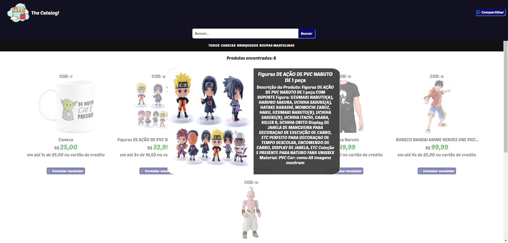
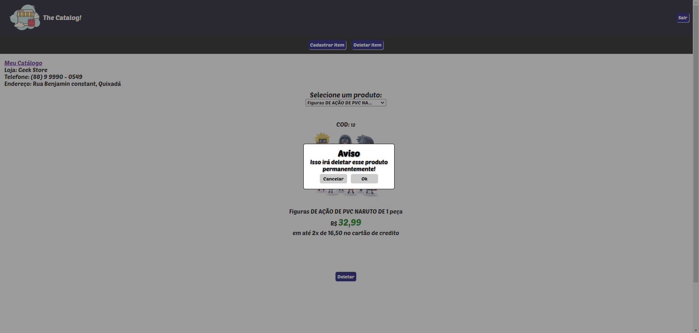
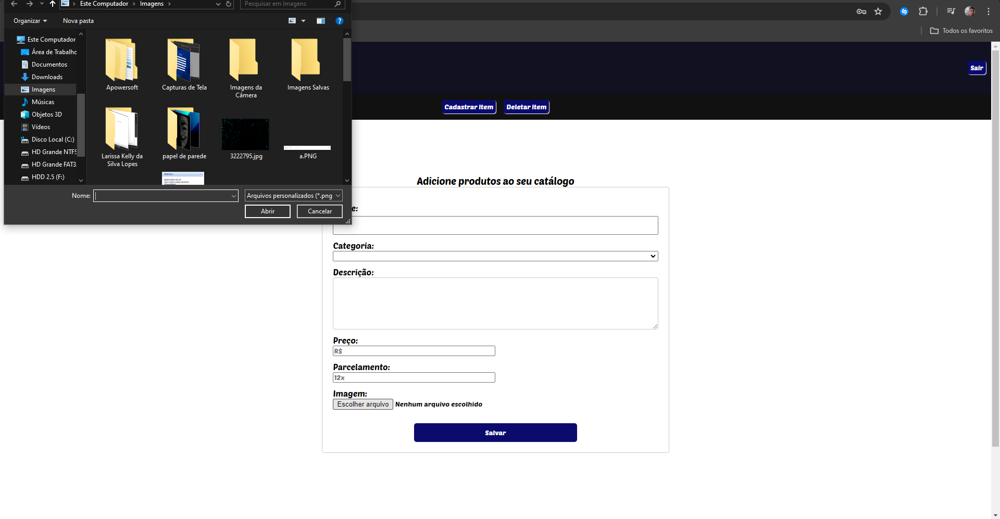
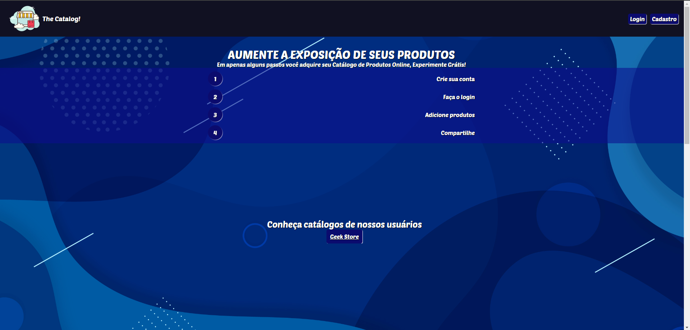
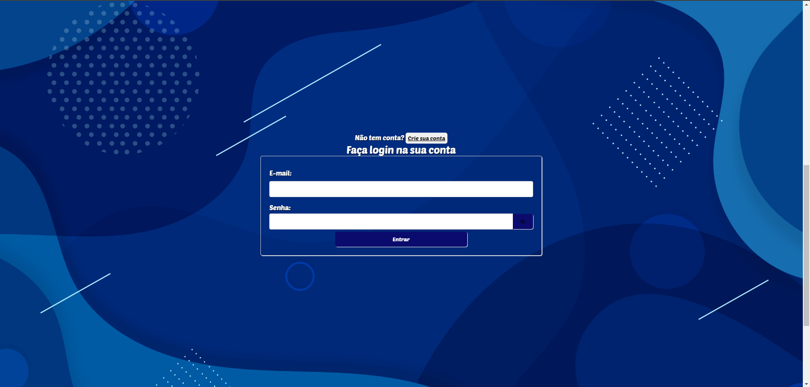
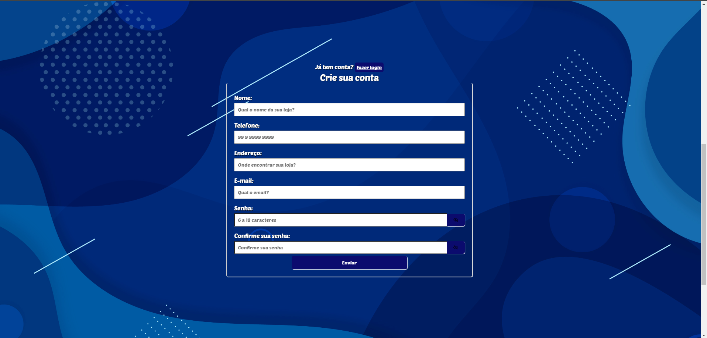

# The Catalog!

## Descrição do Projeto

Com esse sistema você será capaz de divulgar seus produtos de forma rápida e fácil para seus cliente!

## Tecnologias Utilizadas

## Hospedagem

[`https://thecatalog.vercel.app/`](https://thecatalog.vercel.app)

## Capturas de tela

Página onde os produtos são mostrados para os seus clientes

Ao clicar no botão de visualizar o produto

Na página do perfil do usuário quando seleciona um produto para deletar

Cadastrando produtos

Página inicial

Seção de login

Seção de cadastro

